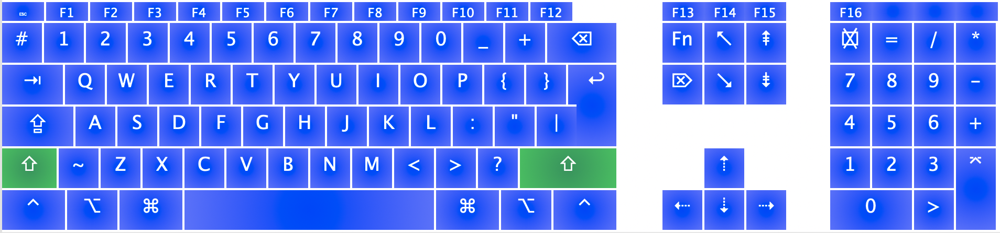

**Trilingua Code Keyboards**

A solution for the creative multilingual pro tired of switching between languages…

# Description

Trilingua Code Keyboards MacOS layouts are for those touch-typing in English, French and Russian — like myself — plus writing code daily, while insisting on typographic niceties and the JKL shortcuts of audio/video editing software built for QWERTY (a long list of requirements!).

I’ve created 2 keyboard layouts:

- **EN+FR Trilingua Code**: combines the English QWERTY standards with French accented letters, specially optimized for coding. It includes an inverted number row for easy access to frequently used coding symbols and with a `Shift` and `Alt` integrates the French diacritics almost like on an AZERTY keyboard. *No keyboard switching required if you stay bilingual.*

- **RU Trilingua Code**: this layout mirrors the structure of EN+FR Trilingua Code, facilitating a fluid transition for those proficient in Russian as well. It still requires some work for a complete replica.

# Details of the layouts

**No modifiers**

**Shift modifier**

**Alt modifier**

**Alt Shift modifier**

# Project Goals

- **Multilingual Coding Efficiency**: Aimed at bridging the gap between English, French, and Russian in coding environments, these layouts simplify the language switching process for touch-typing programmer-designer-filmmakers who want to preserve the access to familiar shortcuts.
- **User-Centric Design**: The layouts are crafted to be intuitive for both bilingual and trilingual users, minimizing the learning curve and maximizing typing proficiency.

# Installation

## MacOS

- download the keyboard bundles from the `Releases`
- unzip into your `~/Library/Keyboard Layouts/` user Library or `/Library/Keyboard Layouts` if you want all users to have access to the keyboards
- go to `System Preferences > Keyboard > Input Sources` or some harder-to-find-with-each-MacOS-release location to enable the keyboards
- most probably, you will have to log-out… gone are the easy days of MacOS 10.0
- I then tend to disable the built-in stock English and French layouts

## All other OSes

- for now, I haven’t compiled anything for Windows or Linux
- you can build your own variants based off the images

# Special features

- top rows optimized for direct access to various brackets **( )**, **[ ]** and **$** dollar sign used in programming
- **“” «»**  typographer’s quotes for English and French in one place
- **—**  m-dash
- **–**  n-dash
- **…**  typographical ellipsis
- **→**  arrow frequently used in design and documentation
- **°**  degree symbol (yes, I do a lot of CAD [@idelekka](https://idelekka.com) as well)
- **≈**  approximate equality sign
- **ø**  diameter symbol
- **€**  Euro, £ Pound currency symbols

# Modification

Feel GPL-free to modify to suit your language (my German is decaying, hence the lack of its support, but you get the umlaut idea).

# Feedback and suggestions

I’m continuously improving and evolving the keyboard layouts and welcome any feedback and contributions.

# To-do

- complete the mirror of the EN+FR to RU
- remove several redundancies — I was testing different placements
